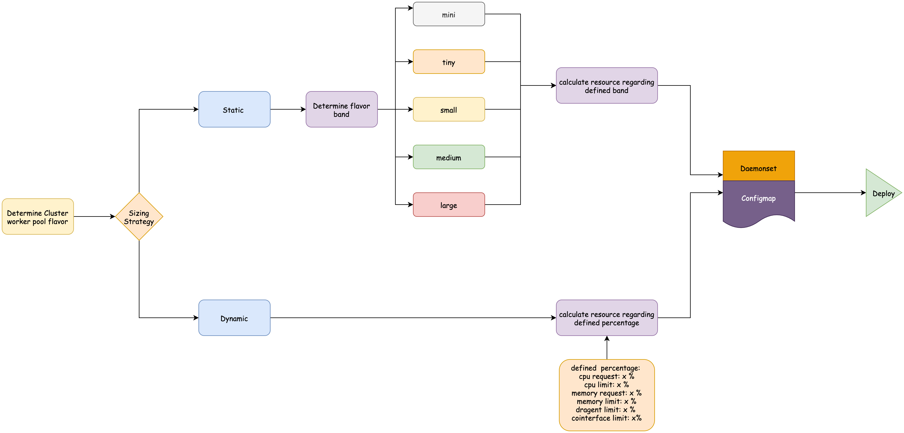

# Sysdig Agent Dynamic Sizing PoC
A PoC to dynamically size the Sysdig Agent depending of the node flavor of the an IKS cluster.

# Architecture



# Steps

**Terraforom init**
```
terraform init
```

**Set configuration**

Modify the config/config.tfvars to your own values: 
```
ibmcloud_api_key="<your_ibm_cloud_api_key>"
sysdig_ingestion_key="<your_sysdig_ingestion_key>"
resource_group="<your_resource_group>"
region = "<your_region>"
cluster_name = "<iks_cluster_name>"
sysdig_agent_namespace = "<the_sysdig_agent_namespace>"
agent_sizing_strategy="< static or dynamic >"
```

**Terraform plan**
```
terraform plan -var-file=config/config.tfvars -state=config/config.tfstate -out=config/config.plan
```

**Terraform apply**

```
terraform apply -var-file=config/config.tfvars -state=config/config.tfstate
```

**Delete all resources**

```
terraform destroy -var-file=config/config.tfvars -state=config/config.tfstate -refresh
```

